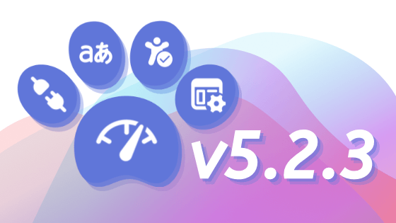
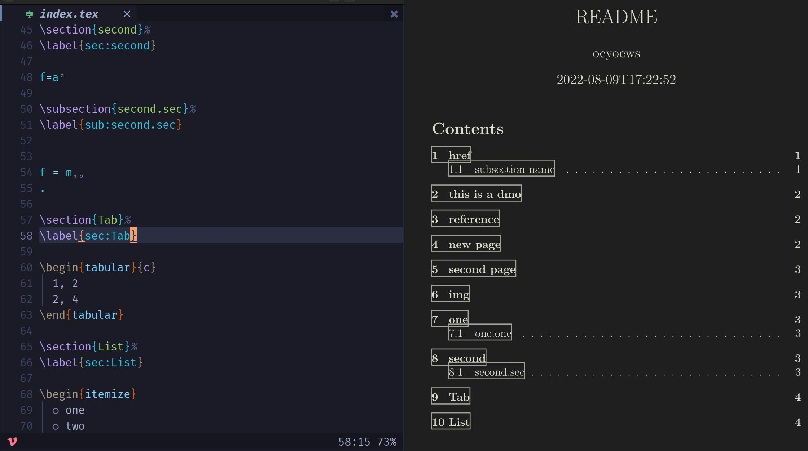
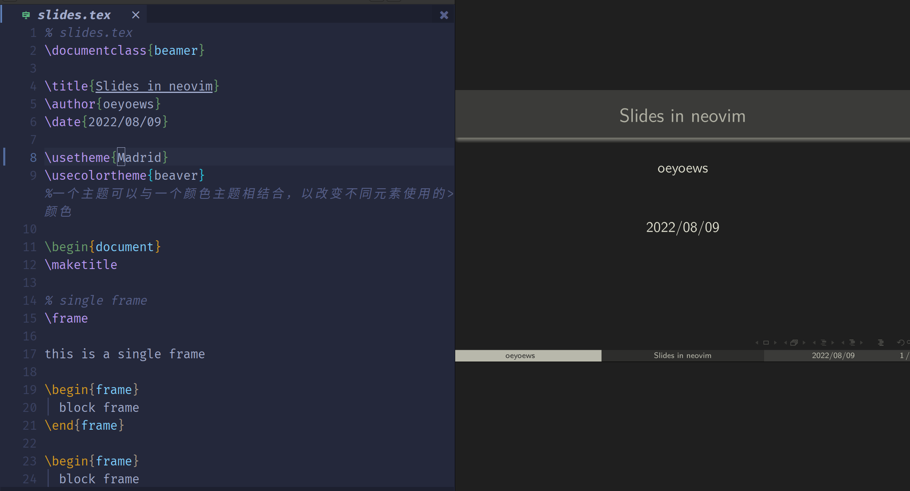
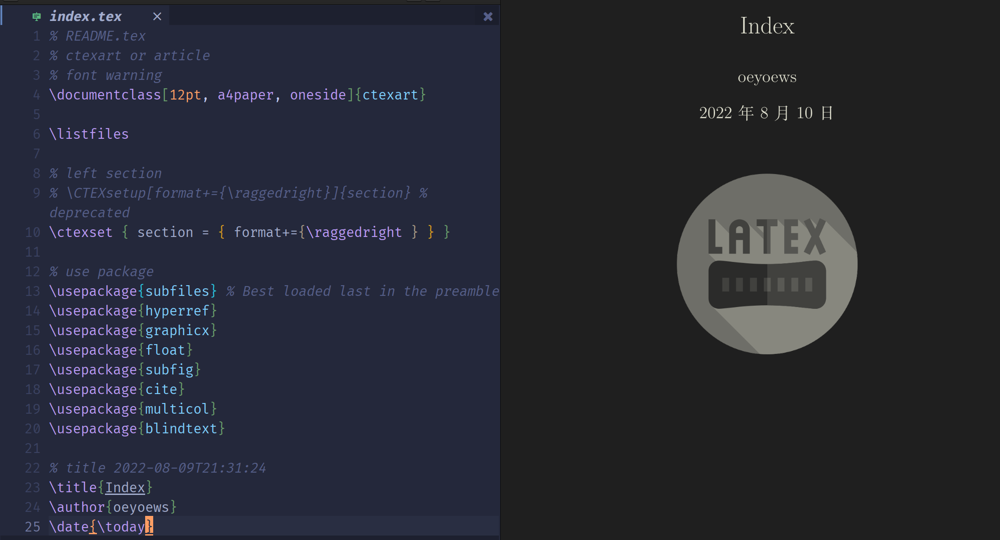
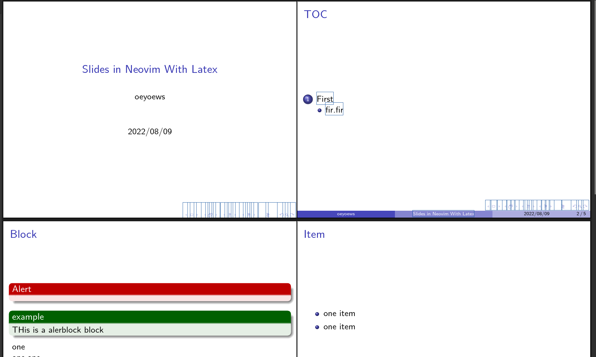

<div align="center">


</div>

<h1 align="center">Tiddlywiki Introduction</h1>

<div align="center">



</div>

## What's that

> 🎊 Tiddlywiki5 tutorials with latex

## Motivation

> For better view Tiddlywiki5, use latex to reorganize tiddlywiki document(not
> official), just some tiddlywiki tips and tutorials

## Note

- use **lualatex** to support emoji, not xelatex or others

## Showcases

<!-- |  |  |  | -->
<!-- | :----------------------------------------------: | :----------------------------------------------: | ------------------------------------------------ | -->
<!-- |  |  |  | -->

## Struct

```bash

├── src
├── img
├── public
├── README.md
├── index.tex
└── test # test

```

## Links

...

## Tutorials

## TODO

## Preview

- Click to preview [main.pdf](dist/main.pdf)

## Videos
