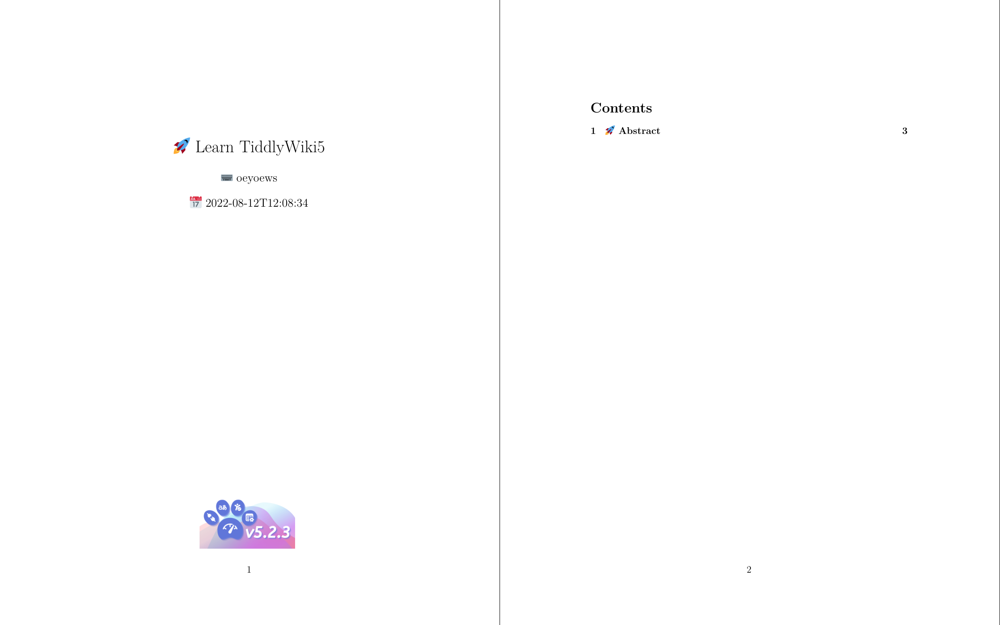

<div align="center">


</div>

<h1 align="center">Tiddlywiki Tutorials</h1>

<div align="center">


</div>

[](https://github.com/tiddly-gittly/brief-tiddlywiki5-introduction/actions/workflows/updatepdf.yml)
[](https://github.com/tiddly-gittly/brief-tiddlywiki5-introduction/actions/workflows/pages.yml)

## What's that

> 🎊 Tiddlywiki5 tutorials with latex

## Motivation

> For better view Tiddlywiki5, use latex to reorganize tiddlywiki tutorials(not
> official), just some tiddlywiki tips and tutorials

## Note

- use **lualatex** to support emoji, not xelatex or others

## Showcases

|  |  |  |
| :----------------------------------------------: | :----------------------------------------------: | ------------------------------------------------ |
|  |  |  |

## Struct

```bash
📂brief-tiddlywiki5-introduction
├── 📂docs
├── 📂img
├── 📝main.tex
├── 📝makefile
├── 📝README.md
└── 📂src
```

## TODO

- how to push generated man.pdf push repo dir, or use gh-pages actions?? related
  ci workflow

## Preview

- Click to preview [learn-tiddlywiki5](https://github.com/tiddly-gittly/brief-tiddlywiki5-introduction/blob/gh-pages/learn-tiddlywiki5.pdf)
